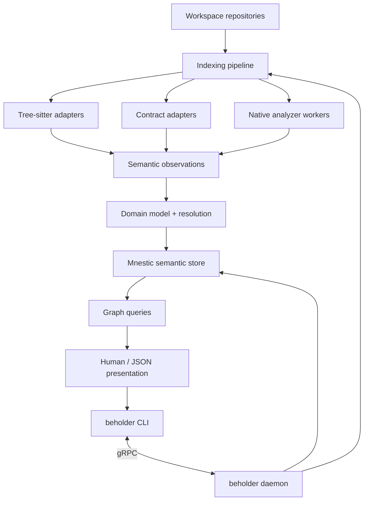

<p align="center">
  
</p>

<h1 align="center">Beholder</h1>

<p align="center">
  <strong>Multi-repository architecture intelligence for software systems.</strong>
</p>

Beholder builds a semantic graph of a software workspace so you can ask architectural questions that do not stop at repository, language, or protocol boundaries.

Instead of treating source files as isolated text, Beholder records semantic entities, relationships, evidence, repository state, and contracts. The goal is to make questions such as these cheap and explainable:

- What calls this function, and what does it call?
- What is the blast radius of changing this entity?
- How does one service depend on another?
- Which implementation backs this gRPC method?
- Which callers depend on a protobuf or GraphQL contract?
- Why does Beholder believe a dependency exists?
- What path connects two entities across repositories?

Beholder is written in Rust and is designed around a **workspace** rather than a single repository. A workspace can contain services, clients, shared contracts, registries, and multiple languages while still being queried as one coherent semantic graph.

> [!NOTE]
> Beholder is under active development. The architecture below describes the current implementation first; longer-term design work lives in [`docs/VISION.md`](docs/VISION.md) and the ADRs under [`docs/adr`](docs/adr).

## Architecture

At a high level, Beholder separates **observation** from **meaning**. Language and contract adapters observe source material and emit normalized semantic facts. The core stores those facts, resolves relationships, and exposes graph-oriented queries through a daemon and CLI.



### 1. Workspace and repository identity

The completed repository revision is Beholder's independently indexable unit. A workspace selects completed repository revisions and materializes their cross-repository relationships as one coherent query view; repositories are ownership boundaries, not graph boundaries.

The Git adapter is responsible for repository identity and state. A repository can be registered and indexed before it belongs to any workspace, and the resulting facts are reused when a workspace later selects it.

This distinction matters for distributed systems. A protobuf registry may declare a contract, one repository may implement it, another may call it, and a client may depend on it indirectly. Beholder models those as relationships between semantic entities rather than assuming the repository containing the contract owns every use of it.

### 2. Fast syntax frontends

The first analysis layer is intentionally cheap and broadly applicable. Tree-sitter adapters extract syntax-backed observations without requiring a full compiler or language server.

The repository currently contains Tree-sitter adapters for:

- Rust
- Elixir
- TypeScript
- C#

These adapters provide the baseline graph: source entities, definitions, references, and other relationships that can be derived reliably from syntax. The indexing layer coordinates discovery and ingestion so adapters do not need to own persistence or workspace lifecycle concerns.

### 3. Contract and protocol adapters

Source code is only part of a service architecture. Beholder therefore models contracts independently from implementations and consumers.

The current adapter layer includes:

- **Protocol Buffers** for protobuf entities and gRPC-oriented contract information;
- **GraphQL** for schema and operation relationships;
- **Git** for repository and revision identity;
- **Mnestic** for persistence and semantic graph storage.

This lets Beholder connect relationships that would otherwise be invisible to a repository-local call graph. A contract can exist as its own canonical entity and later be connected to callers, implementations, producers, consumers, or generated clients using evidence from multiple adapters.

### 4. Semantic domain and evidence

Adapters do not write arbitrary backend-specific records. They produce normalized observations that feed Beholder's domain model.

The core distinction is:

```text
source material
    ↓
observations
    ↓
stored facts
    ↓
resolution / inference
    ↓
canonical relationships
    ↓
queries
```

Relationships are intended to remain evidence-backed. Beholder should be able to explain *why* an edge exists rather than silently collapsing uncertain or inferred information into an opaque graph.

The `domain`, `dto`, and `indexing` crates form the center of this boundary: domain concepts remain independent from the CLI and persistence details, DTOs provide stable transport/query shapes, and indexing orchestrates the production of facts.

### 5. Mnestic persistence

Beholder uses [Mnestic](https://github.com/shuruheel/mnestic) as its semantic fact store and inference layer, with SQLite-backed persistence for normal local use.

The Mnestic adapters and shell isolate storage concerns from the rest of the application. This allows the query and indexing layers to operate on Beholder concepts rather than leaking database representation throughout the codebase.

Indexing is revision-aware so Beholder can publish coherent workspace states instead of exposing a partially updated graph while a reindex is in progress. See [`docs/INDEXING_PERFORMANCE.md`](docs/INDEXING_PERFORMANCE.md) for the current performance model and indexing notes.

### 6. Daemon and gRPC boundary

Long-running state belongs to the `beholder` daemon rather than individual CLI invocations. The daemon owns repository and workspace registration, indexing, persistent graph state, caches, and query execution.

The CLI communicates with it over the typed gRPC protocol implemented by the `protocol`, `daemon`, and `daemon-client` crates. Keeping the process boundary explicit gives Beholder one place to coordinate indexing work and avoids every command independently opening and mutating the graph.

The CLI currently exposes daemon lifecycle management, workspace registration/reindexing, cache administration, inspection tools, benchmarks, and graph queries.

### 7. Progressive semantic enrichment

Tree-sitter is the fast baseline, not the ceiling for language understanding.

Beholder's native analyzer worker architecture allows language-specific semantic analyzers to enrich an existing repository state without coupling those analyzers to the daemon process. The current workspace contains a Rust worker and worker client; ADR 0001 documents the worker model.

The intended pattern is:

```text
Tree-sitter baseline
        ↓
fast, always-available graph
        ↓
optional language-native analyzer
        ↓
more precise semantic contribution
        ↓
new coherent graph revision
```

This is particularly important for languages where syntax alone cannot reliably resolve aliases, imports, macros, generated code, or dynamic conventions. [`ADR 0002`](docs/adr/0002-elixir-compiler-tracer-worker.md) proposes an Elixir compiler-tracer worker; it is design work and should not be confused with the currently implemented CLI surface.

## Crate layout

The workspace is deliberately split by responsibility:

| Area | Crates | Responsibility |
| --- | --- | --- |
| User interface | `cli`, `presentation` | Commands and stable human/JSON output |
| Long-running service | `daemon`, `daemon-client`, `protocol` | Daemon lifecycle and typed gRPC API |
| Core | `domain`, `dto`, `indexing` | Semantic model, transport shapes, indexing orchestration |
| Persistence | `shell-mnestic`, `adapters-mnestic` | Mnestic/SQLite integration |
| Source adapters | `adapters-treesitter-*`, `adapters-git` | Syntax and repository observations |
| Contract adapters | `adapters-protobuf`, `adapters-graphql` | Protocol and schema observations |
| Semantic workers | `worker-client`, `worker-rust` | Optional language-native enrichment |

The important dependency direction is inward: adapters and delivery mechanisms depend on Beholder's core concepts, while the domain model should not depend on a particular CLI, parser, or storage backend.

## Query model

Beholder exposes graph-oriented queries rather than a generic database interface. The current CLI includes:

```text
beholder context <entity>
beholder impact <entity>
beholder dependencies <entity>
beholder trace <from> <to>
beholder why <from> <to>
```

Queries support compact human-readable output as well as stable versioned JSON. `--raw` exposes the uncollapsed semantic graph and evidence when deeper inspection is needed. See [`docs/QUERY_OUTPUT.md`](docs/QUERY_OUTPUT.md) for output conventions.

## Running Beholder

On supported Unix systems, install the CLI, analyzer workers, and user-level daemon service with:

```bash
just install
beholder daemon status
beholder workspace list
```

Repositories can be indexed independently and later reused by workspace views:

```bash
beholder repository register /path/to/repository
beholder index <repository-identity>
beholder index <repository-identity> --workspace <workspace-name>
beholder repository show <repository-identity>
beholder repository delete <repository-identity>
```

`beholder index <workspace-name>` indexes one registered workspace. Every manual
request creates a durable job and prints its ID plus any overlapping work.
Inspect active and recent work with `beholder job list`, then use
`beholder job get <job-id>` for its lifecycle details and typed result.

Deletion is rejected while a workspace references the repository. It never deletes the source checkout; graph facts not retained by a completed workspace revision are cleaned up in the background.

Re-run `just install` after rebuilding Beholder. `just uninstall` removes the installed binaries and service.

TypeScript compiler enrichment remains opt-in until the worker has a hard
process-memory limit. To enable it explicitly for an installed service:

```bash
export BEHOLDER_TYPESCRIPT_WORKER_PATH="$HOME/.local/bin/beholder-worker-typescript"
just install
```

### Shell and daemon environment

Beholder's native analyzers need their language toolchains on `PATH`. With a standard mise installation, expose the shims rather than the `installs` directory, whose immediate children are not executables:

```bash
# ~/.zshenv, and ~/.zshrc if desired
export PATH="$PATH:$HOME/.local/share/mise/shims"
```

Appending avoids an inactive mise shim shadowing a separately installed command, while still making missing toolchain commands available. On macOS, launchd does not source `.zshenv` or `.zshrc`. `just install` therefore writes a stable service PATH containing the conventional mise shims, Cargo, local, Homebrew, and system binary directories. Shell configuration changes affect new shells, not an already-installed daemon service.

### Local observability

To inspect CLI, daemon, and worker traces together with an OTLP/HTTP collector such as `otel-gui`, start the collector before installing Beholder:

```bash
# Terminal 1
otel-gui

# Terminal 2
just install

# `just install` configures the daemon; export these for subsequent CLI commands.
export OTEL_EXPORTER_OTLP_ENDPOINT=http://localhost:4318
export OTEL_EXPORTER_OTLP_LOGS_ENDPOINT=http://localhost:4318/v1/logs
```

`just install` defaults the daemon to this local endpoint and derives its logs endpoint automatically. Just cannot modify its parent shell, so keep these variables in the shell that runs CLI commands if CLI spans and logs should join the daemon service map.

## Development

The repository uses Cargo for Rust, Moon for workspace task orchestration, and `just` as the human-facing developer entry point.

```bash
# See available developer commands
just

# Format, lint, and test
just check

# Run the deterministic end-to-end integration test
just integration-test

# Explore the CLI without installing it
cargo run -- --help
```

## Project direction

The long-term goal is a continuous semantic model that can follow dependencies across source code, RPC boundaries, asynchronous messaging, schemas, backend-for-frontend layers, and clients.

A representative path might eventually look like:

```text
React component
    ↓
GraphQL operation
    ↓
GraphQL field
    ↓
resolver
    ↓
gRPC method
    ↓
service handler
    ↓
Kafka topic
    ↓
protobuf contract
    ↓
consumer
```

Beholder should be able to traverse that as one evidence-backed path even when the nodes are spread across languages and repositories.

For the deeper design, rationale, and planned capabilities, start with [`docs/VISION.md`](docs/VISION.md). Architectural decisions for language-native enrichment are recorded in [`docs/adr`](docs/adr).

## Status

Beholder is experimental and its interfaces are still evolving. The current focus is on making the semantic model, indexing pipeline, workspace lifecycle, and query surface solid enough to dogfood Beholder on itself before expanding the breadth and precision of cross-language analysis.
