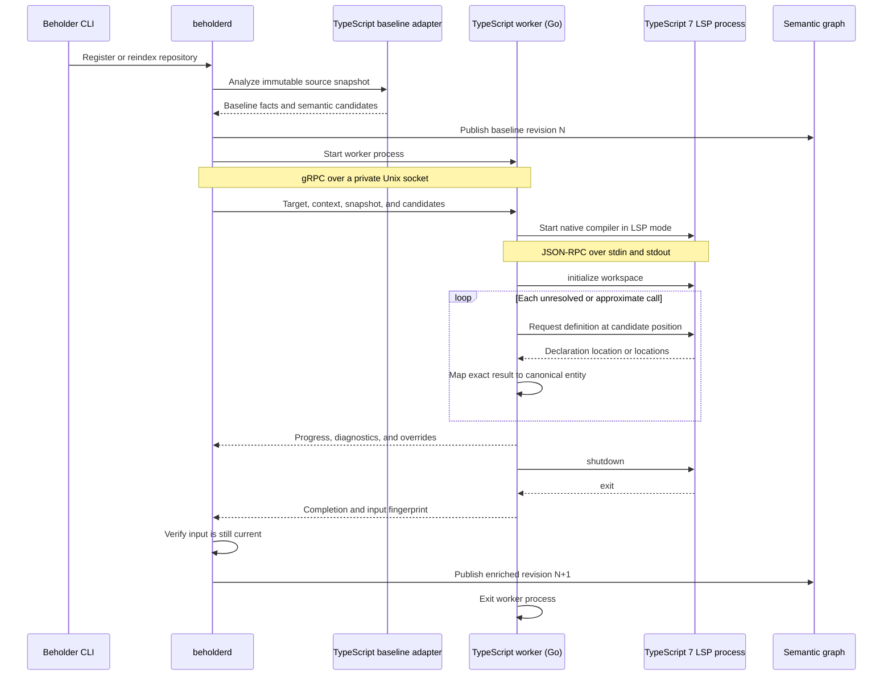

# ADR 0003: TypeScript native semantic worker

- Status: proposed
- Date: 2026-08-21

## Context

ADR 0001 introduced language-specific workers so Beholder can publish a fast
Tree-sitter graph before progressively adding compiler-backed facts. The
TypeScript baseline already extracts declarations, imports, exports, calls,
framework facts, and approximate workspace resolution. It cannot reliably
resolve aliases, receiver dispatch, overloads, path mappings, or project
references without TypeScript's type system.

TypeScript 7 is a native Go port of the compiler and language service. The 7.0
release exposes a command-line compiler and an LSP server, but does not expose a
supported programmatic API. The compiler's parser, binder, checker, project,
and API packages currently live below Go's `internal` boundary. Microsoft
expects a new and different public API in TypeScript 7.1.

TypeScript 6 retains the JavaScript compiler API and Microsoft provides
`@typescript/typescript6` as a compatibility package. Building a production
worker against that API would, however, make the worker depend on the final
JavaScript compiler generation just as TypeScript projects move to the native
compiler. Reimplementing that worker in Go later would duplicate project
discovery, source identity, protocol, caching, diagnostics, and contribution
mapping work.

Rust libraries used by Deno, SWC, and Oxc can parse, transform, and resolve
lexical or module structure, but they do not provide a TypeScript-compatible
type checker with resolved signatures and receiver types. Deno's type-checking
path still embeds the JavaScript TypeScript compiler. Oxc's type-aware linting
uses `typescript-go` rather than a Rust type checker.

## Decision

### Worker language and compiler boundary

The TypeScript semantic worker will be implemented in Go. Compiler integration
is hidden behind a small Beholder-owned semantic-engine interface. Worker
protocol handling, project discovery, immutable-input validation, canonical
entity mapping, contribution construction, diagnostics, and caching do not
depend on a particular compiler access mechanism.

The intended engines are:

1. a provisional TypeScript 7 LSP engine communicating with the native server
   over JSON-RPC on stdio; and
2. a native compiler API engine once TypeScript publishes a supported Go API.

The worker will not import `typescript-go/internal`, copy those packages under
new import paths, or maintain generated shims around them. Those approaches can
work when pinned to an exact compiler commit, but they make upstream internal
refactors part of Beholder's maintenance surface.

The worker will not ship a TypeScript 6 compiler-API engine as its production
backend. TypeScript 6 may be used in fixtures as a comparison oracle while the
native integration is validated.

### Process topology and lifecycle

The TypeScript worker and the TypeScript language server are separate child
processes with different protocol roles. The daemon starts the Go worker and
acts as its gRPC client. The worker in turn acts as an LSP client and starts the
native TypeScript executable in LSP mode over stdio.

An LSP server must remain running while it answers requests, but it is not a
permanently installed network service. The initial implementation scopes both
child processes to one enrichment job. The worker initializes the language
server, queries every eligible candidate, requests shutdown, and exits after
publishing its contribution. Persistent workers or language servers may be
introduced later only when measurements justify the additional invalidation,
memory, and supervision complexity.

### LSP feasibility gate

Before implementing the production worker, a time-bounded spike will start a
pinned TypeScript 7 executable in LSP mode over stdio and query semantic facts
for source candidates identified by the baseline adapter. The spike must cover:

- direct and imported function calls;
- aliased imports and re-exports;
- member and constructor calls;
- optional-chain calls;
- overloads and generic calls where the server exposes an unambiguous target;
- `tsconfig` path mappings and project references;
- a multi-project monorepo; and
- cross-repository declarations available in the workspace context.

It must also measure compiler startup time, request count, elapsed analysis
time, and peak resident memory on a representative repository.

The LSP engine may become the initial production engine only when standard LSP
requests return declaration locations precise enough to map a candidate to one
canonical Beholder entity. The worker does not promote multiple, incomplete,
or inferred navigation results to exact overrides. Those candidates retain the
baseline relationship and receive coverage or diagnostic information.

Beholder will not depend on undocumented custom LSP methods as its stable
semantic interface. If standard LSP cannot provide enough exact information,
worker implementation waits for the supported native API rather than binding
to compiler internals or shipping knowingly approximate compiler overrides.

### Baseline semantic candidates

The worker protocol will carry baseline semantic candidates as a
language-neutral request input alongside repository files. This avoids asking
each worker to recreate syntax analysis in its implementation language and
gives every compiler worker a stable observation to refine.

A semantic candidate includes at least:

- the source entity ID and dependency relation;
- the existing approximate or unresolved target identity;
- repository-relative source path and precise start and end positions;
- baseline evidence and provenance; and
- a stable observation identity when more than one candidate otherwise has the
  same source, relation, and target.

The daemon derives these candidates from the completed baseline revision and
streams only candidates owned by the target repository. Context repositories
remain available for target resolution but do not transfer ownership of their
observations to the job.

Worker output refers to the baseline observation identity when contributing an
override or an unresolved reason. The daemon rejects an override that cannot be
joined to the current baseline candidate. This establishes an explicit
refinement relationship and prevents line-only or name-only matching from
silently changing the wrong edge.

The candidate input is part of the common worker protocol rather than a
TypeScript-only message. Existing workers may adopt it incrementally; its
presence does not require a worker to refine every candidate or prevent a
compiler from discovering additional facts supported by its contribution
schema.

### Progressive contribution scope

The initial worker enriches existing TypeScript source identities rather than
building a second graph. The baseline adapter records candidate call sites with
precise source spans. For each eligible candidate, the worker maps the semantic
declaration location back to an existing entity and may contribute an exact
`DependencyOverride` with compiler provenance.

The initial contribution is limited to compiler-proven call resolution for:

- direct, imported, and re-exported functions;
- aliased symbols;
- instance and static member calls;
- constructors; and
- calls whose declaration belongs to another registered repository.

Definitions from TypeScript standard libraries or installed third-party
declaration files do not become workspace source entities. External package
entities, complete type-reference indexing, inheritance relationships,
interface implementation mapping, and type-driven framework enrichment are
follow-up work.

The baseline graph remains useful when the compiler is unavailable, project
loading fails, dependencies are absent, the job exceeds its resource limits,
or no semantic result can be mapped with sufficient certainty. As with other
workers, a result publishes as a new revision only if its immutable input is
still current, and a later run atomically replaces only this analyzer's
contribution.

### Incremental refresh and cache boundary

TypeScript enrichment must remain useful in workspaces where repositories
change frequently. A worker contribution is therefore owned and identified by
the workspace, target repository, and analyzer rather than by one indivisible
workspace revision. Publishing a new baseline carries forward contributions
whose target input identities remain valid and queues only target repositories
whose semantic inputs changed.

The contribution input identity covers the target repository's baseline facts
and semantic candidates, the worker and schema versions, compiler inputs, and
only the read-only repository context capable of changing the target result.
An unrelated repository update does not invalidate the contribution. A change
to a project reference, relevant cross-repository declaration, compiler
configuration, manifest, lockfile, or dependency does.

Jobs are keyed by `(workspace, target repository, analyzer)`. A newer input
coalesces a queued job and cooperatively cancels a running superseded job. The
daemon validates the returned target input identity before publication and
atomically replaces only that target repository's analyzer contribution.
Completed contributions are persisted so an unchanged daemon restart does not
require compiler analysis.

This lifecycle is tracked by
[issue 82](https://github.com/benediktms/beholder/issues/82) and is required
before automatic TypeScript worker activation. It is distinct from
[issue 54](https://github.com/benediktms/beholder/issues/54), which scopes
analyzer-plugin cache identity for baseline source, repository, and workspace
analysis. Keeping a TypeScript worker or LSP process warm across jobs remains a
measured follow-up; repository-scoped reuse and scheduling do not depend on a
persistent compiler process.

### Project input and execution safety

TypeScript enrichment is repository-scoped. The target repository owns the
contribution; other registered repositories may be supplied as read-only
compiler context for project references and cross-repository resolution. This
depends on the target-versus-context worker semantics proposed by ADR 0002.

The worker discovers `tsconfig` and `jsconfig` projects, follows project
references, and deduplicates source files loaded by more than one project. A
configuration inferred from source files or `package.json` is a fallback for
JavaScript repositories without an explicit project configuration.

The initial LSP backend operates on the checked-out filesystem. It verifies
snapshot-owned source and configuration files against the immutable Beholder
input before and after semantic analysis. A mismatch makes the result stale and
prevents publication.

The worker does not install dependencies, run package-manager commands, execute
package lifecycle scripts, emit JavaScript, load language-service plugins, or
load custom compiler transforms. It consumes dependencies already present on
disk. Missing dependencies reduce coverage but do not fail baseline indexing.
Automatic activation is allowed once repository-scoped scheduling, executable
discovery, timeouts, and memory limits are in place because this restricted
analysis does not intentionally execute repository application or build code.

### Identity and observability

The TypeScript contribution identity includes at least:

- the target repository baseline and semantic-candidate identities;
- worker and contribution-schema versions;
- semantic engine kind and compiler version;
- relevant `tsconfig`, extended configuration, and project-reference inputs;
- package manifests, workspace definitions, and lockfiles; and
- analysis-relevant compiler context identity.

The worker records spans for project discovery, compiler startup, project
loading, semantic queries, identity mapping, and contribution publication. It
reports project and source counts, candidate and override counts, unresolved
reasons, elapsed time, and available resource measurements through the common
worker telemetry path.

## Consequences

- The durable worker implementation aligns with TypeScript's native compiler
  direction without depending on an unfinished API.
- Replacing LSP with the supported native API changes one engine rather than
  requiring a worker rewrite in another language.
- Candidate-driven LSP queries reuse the fast baseline and avoid asking an
  editor-oriented protocol to rediscover the entire graph.
- A common semantic-candidate input removes language-specific duplication and
  makes every compiler override traceable to one baseline observation.
- Repository-scoped contribution reuse keeps unrelated repository updates from
  triggering whole-workspace compiler reruns, while relevant context changes
  still invalidate affected targets.
- The feasibility gate may defer the worker until TypeScript 7.1 if LSP results
  are too ambiguous or expensive.
- Go becomes an additional Beholder worker toolchain and requires generated
  worker-protocol bindings, packaging, CI, and release integration.
- Filesystem-backed compiler analysis requires explicit stale-input checks and
  dependency/configuration fingerprints beyond ordinary source content.
- Compiler enrichment improves exact static dispatch but does not resolve
  runtime reflection, dynamic property access, dependency-container behavior,
  or other relationships without separate evidence.

## Rejected alternatives

### Implement the worker in TypeScript against the TypeScript 6 API

Rejected as the production architecture because it targets the final
JavaScript compiler generation and creates a likely language and integration
rewrite when the native API becomes available.

### Import or mirror `typescript-go` internal packages

Rejected because the packages are deliberately outside Go's public import
surface. Generated shims and mirrored packages transfer upstream internal
churn, compatibility testing, and compiler pinning onto Beholder.

### Implement semantic enrichment with Deno, SWC, or Oxc Rust crates

Rejected because their Rust surfaces provide parsing, transformation, module
graphs, or lexical semantics rather than TypeScript-compatible type and
signature resolution. They would duplicate the existing syntax baseline
without providing the compiler evidence this worker is intended to add.

### Consume a SCIP TypeScript index

Rejected for the initial worker because SCIP primarily models symbols,
definitions, and references. Translating its index back onto Beholder call-site
candidates adds another protocol and identity layer without directly supplying
the exact dependency overrides required by the initial scope.

### Wait for the native API before doing any work

Rejected because the worker boundary, precise source candidates, project
fixtures, and LSP feasibility can be designed and measured independently. The
production semantic backend remains gated when those measurements cannot prove
safe exact enrichment.

## References

- [TypeScript 7.0 announcement](https://devblogs.microsoft.com/typescript/announcing-typescript-7-0/)
- [`microsoft/typescript-go` implementation status](https://github.com/microsoft/typescript-go)
- [`tsgolint` TypeScript-Go shim modules](https://github.com/oxc-project/tsgolint/blob/main/go.mod)
- [Deno compiler integration](https://github.com/denoland/deno/tree/main/cli/tsc)
- [Oxc architecture](https://github.com/oxc-project/oxc/blob/main/ARCHITECTURE.md)
