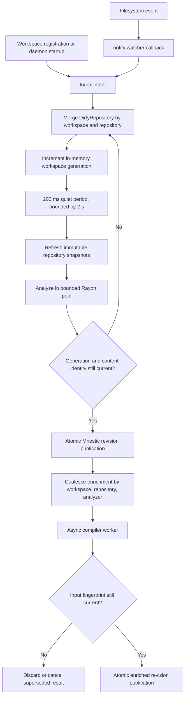
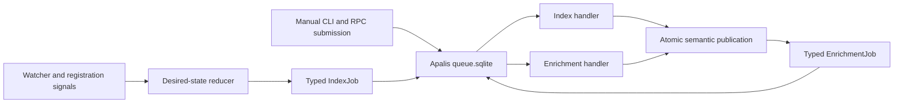

# ADR 0006: Adopt Apalis for durable background work execution

- Status: accepted
- Date: 2026-08-25
- Tracking: https://github.com/benediktms/beholder/issues/126
- Foundation: https://github.com/benediktms/beholder/issues/119

## Decision

Adopt Apalis with its SQLite backend for Beholder's automatic and manual indexing
and enrichment work. Store its queue in a dedicated `queue.sqlite`; do not put
queue tables in Mnestic's database.

Keep Beholder's desired-state reduction, content verification, generation and
fingerprint guards, cooperative cancellation, and atomic Mnestic publication
boundaries. Apalis owns job identity, typed payloads, execution status,
scheduling, attempts, retry timing, worker ownership and liveness, errors, and
terminal results. It does not become the authority for what repository state
should exist.

Use the verified workspace-local `sqlite3-src` compatibility provider so Mnestic
and Apalis share `libsqlite3-sys` without changing or forking Mnestic.

## Current architecture

There is no indexing `mpsc` queue. `IndexScheduler` owns coalesced desired state
and wakes one scheduler loop with `tokio::sync::Notify`.

The implementation responsibilities are:

| Responsibility | Current owner |
| --- | --- |
| Watch registration and callbacks | `crates/daemon/src/daemon.rs` |
| Intent normalization, debounce, generations, bounded retries, shutdown | `crates/daemon/src/indexing/scheduler.rs` |
| Repository inventory and immutable snapshots | `crates/daemon/src/indexing/inventory.rs` |
| Baseline analyzer composition and bounded parallelism | `crates/indexing/src/lib.rs` |
| Enrichment coalescing, cancellation, and execution | `crates/daemon/src/indexing/enrichment.rs` |
| Revision and enrichment lifecycle persistence | `crates/adapters-mnestic/src/storage.rs` |
| Manual indexing entry points | `crates/daemon/src/rpc_service.rs` |
| Spans, OTLP export, and trace propagation | `crates/observability/src/lib.rs` and `crates/worker-client/src/lib.rs` |

`DirtyRepository` merges source, configuration, `HEAD`, and reconciliation
intents. Broader intents subsume narrower ones. More than 1,024 paths or 4,096
events promote a storm to reconciliation. Continuous changes cannot defer a batch
beyond two seconds. One global scheduler operation serializes baseline
publication, standalone repository publication, checkpoints, and maintenance;
source analysis inside that operation is parallel.

Automatic baseline failures retry five times with exponential delays beginning
at 250 ms. The workspace stays dirty when retries are exhausted, and a later
filesystem event, watcher reconciliation, restart, or manual request may enqueue
current state again. Manual indexing uses the same durable worker and guarded
publication path as automatic indexing.

Compiler jobs use an in-memory map keyed by
`(workspace, repository, analyzer)`. A newer fingerprint replaces queued work and
cooperatively cancels an active superseded run. Retry count, next retry time,
error, analyzer version, and input fingerprint are persisted in Mnestic. Five
attempts are allowed with the same 250 ms exponential base.

### Work model and scope

Baseline work is keyed by workspace name, with one merged `DirtyRepository` per
logical repository. The registered canonical worktree and descriptor set scope
inventory refresh; `WorkspaceView` carries the repository states that scope
publication. The in-memory generation is a stale-result guard, not a durable job
identity. It may restart from zero because content and analyzer identity are
verified again before publication.

Enrichment work is keyed by `(workspace, target repository, analyzer)` and carries
the immutable target input fingerprint, repository-scoped compiler context,
analyzer version, snapshot, and view. This is already the deterministic identity
needed for coalescing; adding a generic `job_kind` or separate `worktree_id` would
duplicate typed state Beholder already owns.

### State and recovery

| State | Lifetime | Recovery consequence |
| --- | --- | --- |
| Dirty intents, generations, debounce timers, baseline retry count | Memory | Lost on crash; every registered workspace is marked for authoritative indexing on startup. |
| Active operation and enrichment cancellation handles | Memory | Lost on crash; no graph fact depends on them. |
| Workspace registry | Disk | Recreates watcher ownership and startup indexing. |
| Inventory manifests and content blobs | Disk, rebuildable | Accelerate validated reindexing but never authorize a semantic revision. |
| Baseline and enriched graph revisions | Mnestic | A write transaction either publishes the complete revision or leaves the previous revision active. |
| Enrichment status and retry state | Mnestic | Survives restart, but currently has the recovery gap below. |

Baseline queue durability is unnecessary for correctness: repositories and
workspace registration are the durable input, startup revalidates them, and
periodic reconciliation repairs missed watcher events. Generations 41 and 42 may
disappear when 43 exists; only analysis of current desired state may publish.
Earlier path intents must first be merged into that desired state, which is why a
FIFO deduplication key cannot replace `DirtyRepository`.

Queries keep reading the last completed revision while a replacement is built.
The scheduler checks shutdown between inventory, analysis, verification, and
publication. Graceful shutdown stops accepting new work and waits for the active
blocking operation and checkpoint; it does not interrupt synchronous analyzer
code in the middle of a call. A process crash relies on transaction atomicity and
startup reconstruction instead.

### Legacy recovery during rollout

An enrichment is persisted as `running` before its worker future starts. A daemon
crash or forced shutdown can leave that row behind. On restart,
`prepare_enrichment` returns `Running`, while the in-memory `enriching` map is
empty.

This foundation intentionally adds no recovery for that legacy orphaned state.
The first executable migration slice adds startup recovery for durable Apalis
reservations; slice six replaces the legacy enrichment lifecycle and its recovery
gap entirely. Publication remains safe because it rejects stale fingerprints and
superseded analyzer versions.

## Apalis evaluation

Versions inspected on 2026-08-24:

- [`apalis-sqlite` 1.0.0-rc.8](https://crates.io/crates/apalis-sqlite/1.0.0-rc.8),
  published 2026-05-07;
- [`apalis` 1.0.0-rc.9](https://crates.io/crates/apalis/1.0.0-rc.9),
  published 2026-05-06.

The current line is still a release candidate. The published source was checked,
not only its README.

| Capability | Verified behavior | Beholder consequence |
| --- | --- | --- |
| Durable enqueue | Jobs are inserted into SQLite before execution. | Useful, but baseline indexing is already reconstructible. |
| Worker loss | Worker heartbeats default to 30 seconds; work owned by a dead worker is re-enqueued after a configurable interval, five minutes by default. Recovery is at-least-once. | Would fix orphan execution, but job handlers must remain idempotent and publication-guarded. |
| Long-running jobs | Liveness is worker-based, not a fixed per-job lease. A healthy worker can run for minutes. | Suitable for indexing, provided the worker runtime continues heartbeating. |
| Graceful shutdown | The monitor stops intake and drains tracked futures indefinitely unless a terminator or shutdown timeout drops them. Dropped work is later orphan-recovered. | Beholder must still choose drain versus cancel per job kind. |
| Retries | SQL attempts and per-task maxima are persisted; failed work is eligible again. Backoff and transient/permanent classification require policy configuration. | Beholder's typed failure policy remains application logic. |
| Idempotency | rc.8 adds a unique `(job_type, idempotency_key)` index and enqueue uses `ON CONFLICT DO NOTHING`. | Prevents duplicate insertion, but does not merge intents, replace payloads, cancel active stale work, or remove old generations. |
| Scheduling | `run_at`, priority, polling, and multiple workers are supported. | More machinery than the current single-daemon desired-state loop needs. |
| SQLite | Setup enables WAL, `synchronous=NORMAL`, in-memory temporary storage, a 64,000-page cache, SQLx pooling, and migrations. Polling begins at 100 ms with backoff; an update-hook mode also exists. | Use a dedicated database. The native dependency conflict is resolved by the verified compatibility provider below. |
| Cleanup | The exposed vacuum operation deletes terminal rows and executes full `VACUUM`. | Retention and when to run blocking maintenance remain Beholder-owned. |
| Multiple job types | Separate typed storage handles can share a pool; `SharedSqliteStorage` multiplexes typed queues. | Technically possible, though each Beholder job still needs its own domain policy. |
| Tracing | A Tower tracing layer emits task spans with task ID and attempt. Producer-to-consumer OpenTelemetry context works when `TracingContext` metadata is explicitly attached. | Trace propagation is available but not automatic from Beholder spans. |
| Metrics | Optional layers emit consumed-task count and execution duration. SQL inspection APIs expose queue state. | Queue latency, queued/active/dead gauges, retry counts, and Beholder dimensions still need explicit instrumentation. |

### What Apalis would replace

For automatic baseline indexing, Apalis could replace only the wake/retry timer
and task-execution shell around `reindex_dirty`. It would not replace filesystem
event classification, `DirtyRepository` merging, generation checks, inventory
refresh, analyzer execution, or atomic publication.

For enrichment, it could replace the in-memory pending map, retry sleepers,
worker heartbeat, and some persisted execution status. Beholder would still own
target/context identity, active-run supersession, cooperative cancellation,
analyzer-version checks, contribution ownership, and current-fingerprint
publication. Manual index RPCs would either remain direct or require a deliberate
asynchronous API change.

No adapter, analyzer, worker protocol, semantic relation, query, or Mnestic
publication code becomes redundant. Apalis would replace plumbing at the edge of
the difficult logic rather than the difficult logic itself.

Relevant upstream implementation points are the
[`Config` defaults](https://github.com/apalis-dev/apalis/blob/v1.0.0-rc.9/apalis-sql/src/config.rs),
[`apalis-sqlite` setup and worker backend](https://github.com/apalis-dev/apalis-sqlite/blob/v1.0.0-rc.8/src/lib.rs),
[`Jobs` schema](https://github.com/apalis-dev/apalis-sqlite/blob/v1.0.0-rc.8/migrations/20251018164941_move_to_bytes.sql),
[`idempotency` migration](https://github.com/apalis-dev/apalis-sqlite/blob/v1.0.0-rc.8/migrations/20260506101935_idempotency_key.sql),
[`orphan recovery` query](https://github.com/apalis-dev/apalis-sqlite/blob/v1.0.0-rc.8/queries/backend/reenqueue_orphaned.sql), and
[`Monitor` shutdown](https://github.com/apalis-dev/apalis/blob/v1.0.0-rc.9/apalis-core/src/monitor/mod.rs).

### SQLite dependency integration

The current packages cannot be added to `beholderd` without changing Beholder's
SQLite dependency topology.

Beholder enables Mnestic's `storage-sqlite-src` feature and uses `sqlite 0.36.2`,
which brings `sqlite3-src 0.6.1` with `links = "sqlite3"`.
`apalis-sqlite` uses SQLx 0.8.6, which brings `libsqlite3-sys` with the same Cargo
`links = "sqlite3"` value. A temporary resolver check with only
`sqlite = "=0.36.2"` and `apalis-sqlite = "=1.0.0-rc.8"` fails because Cargo
allows only one package to own a native link name.

Changing Mnestic's manifest to use `libsqlite3-sys` works, but Beholder does not
own Mnestic and will not depend on an unreleased revision or maintain a fork.
Changing the high-level `sqlite` crate also works but merely moves the fork.

A no-fork compatibility option was verified instead. A small Beholder-owned
crate can provide the package identity `sqlite3-src 0.6.1` through Cargo's
workspace-wide `[patch.crates-io]`. Its existing `bundled` feature delegates to
`libsqlite3-sys/bundled`, and its Rust library explicitly references
`libsqlite3_sys` so the native link metadata is retained. Mnestic and `sqlite`
remain the unmodified crates.io releases.

The shim prototype resolved one `libsqlite3-sys 0.30.1` native provider shared
by Mnestic and SQLx. One process successfully created and reopened a Mnestic
database, passed SQLite `PRAGMA integrity_check`, and ran Apalis migrations
against a separate queue database. A second executable without Apalis proved
that the same shim links published Mnestic independently, matching Beholder's
CLI topology.

This removes the dependency conflict without changing third-party source, but it
is still a deliberate compatibility shim. It relies on `sqlite3-src` remaining a
link-provider dependency rather than a Rust API and must be revalidated whenever
Mnestic, `sqlite`, `sqlite3-sys`, SQLx, or `libsqlite3-sys` changes. Validate both
the standalone CLI and combined daemon topologies on the existing Linux and
macOS CI platforms. A separate `queue.sqlite` file remains a runtime isolation
choice, not a compile-time fix.

## Accepted target architecture

The ownership boundary is final:

- Apalis is the sole authority for job identity, typed payload, status, attempts,
  retry timing, worker ownership and heartbeat, errors, and terminal results.
- Beholder owns desired-state reduction, typed targets and triggers, generation
  and fingerprint guards, prerequisite and supersession policy, cooperative
  cancellation, content verification, and analyzer selection.
- The semantic backend owns completed baselines and enrichments, currentness,
  contribution ownership, and atomic publication. It does not mirror job
  execution lifecycle or expose backend row identities to the queue.
- Filesystem contents, Git identity, and registered repository and workspace
  configuration remain authoritative inputs. Jobs persist identifiers and intent,
  never source bytes, snapshots, graph facts, plugin environments, or semantic
  backend row IDs.

`IndexJob` has a typed workspace or repository target, with an optional workspace
scope on repository targets; an automatic or manual trigger; prerequisite
`IndexJob` IDs; an optional automatic workspace generation; and reduced repository
intents containing relative source or configuration paths, `HEAD` changes, or
authoritative reconciliation.
`EnrichmentJob` has a typed workspace-repository or standalone-repository target;
a stable worker ID and expected version; an automatic or manual trigger;
prerequisite `IndexJob` IDs; and a resolved input fingerprint when one is
available.

The daemon opens one SQLx pool at `state_dir().join("queue.sqlite")` and derives
separate typed Apalis storage handles for the stable `index` and `enrichment`
queues. There is no generic queue trait. Both job kinds initially run with global
concurrency one and five total attempts, delayed by 250 ms, 500 ms, one second,
and two seconds before attempts two through five. The deployed index worker polls
at a fixed 100 ms interval: the pinned SQLite fetcher does not reset its default
backoff after a successful fetch, so retaining that backoff would leave work idle
for as long as 60 seconds after quiet periods.

### Queue lifecycle and failure policy

Before a normal open, an existing `queue.sqlite` is opened read-only and must
return exactly `ok` from `PRAGMA quick_check`. The daemon then opens the database
with create-if-missing and runs `SqliteStorage::setup` on every startup so SQLx and
Apalis migrations are authoritative. Open, quick-check, migration, and
incompatible-schema failures abort startup without modifying, moving, or replacing
the unusable file. Full `integrity_check` and any repair remain manual diagnosis.

A missing file, including one deleted externally after a prior daemon run, is a
fresh queue: recreate and migrate it without a marker or reset command. Deleting
the queue loses job history but not completed semantic state. Terminal jobs are
retained indefinitely and Apalis vacuum is never invoked.

Once execution is enabled, a durable SQLite write or I/O failure is daemon-fatal:
fail the current submit or acknowledgement, close intake, perform bounded shutdown,
and exit non-zero. Startup recovers reservations before admitting work. Shutdown
closes admission first, then gives the entire daemon one fixed ten-second deadline;
unfinished work is recovered on restart. A publication committed before an
acknowledgement failure may replay and is made safe by currentness guards.

### Public API and operability

The asynchronous API remains on `beholder.v1.Daemon`; protocol version 19 exposes
`SubmitIndex`, `SubmitEnrichment`, `ListJobs`, and `GetJob`. Public IDs are opaque
Apalis ULIDs and public statuses are queued, waiting, running, completed, and
failed. `beholder jobs list` orders active work first and returns terminal history
in stable 15-row keyset pages; `beholder job get` exposes typed targets, triggers,
attempts, prerequisites or wait reasons, safe errors and warnings, timestamps, and
typed results without raw Apalis payloads or metadata.

Manual indexing always enqueues and reports the new ID plus overlapping
non-terminal work. Repository work targets every containing workspace by default,
can be scoped to one workspace, and remains first-class standalone work when no
workspace contains it. Manual enrichment creates or reuses one job per selected
workspace-worker or standalone-worker target and reuses index prerequisites. The
synchronous indexing RPCs and commands are deleted in the same slice that adds
their asynchronous replacement; no fallback executor is retained.

The jobs API is the lifecycle authority. Existing OpenTelemetry traces and
structured logs carry a bounded job contract and W3C enqueue context; each attempt
is a child of the enqueue span and retries are sibling attempts. No metrics
pipeline or per-attempt ledger is introduced.

## Seven-slice rollout

Each executable slice directly replaces and deletes its predecessor after focused
equivalence checks. There is no final cleanup slice or runtime fallback switch.
Only technical dependencies block delivery; slices four and five may proceed in
parallel with indexing work.

1. [Inert Apalis queue foundation and ADR update](https://github.com/benediktms/beholder/issues/119).
2. [Automatic indexing plus job inspection](https://github.com/benediktms/beholder/issues/120): move automatic baseline execution to `IndexJob`, add recovery, admission, shutdown and telemetry, and ship `ListJobs` and `GetJob`.
3. [Asynchronous manual indexing command](https://github.com/benediktms/beholder/issues/121): add `SubmitIndex` and `beholder index`, then delete synchronous indexing APIs and commands.
4. [Backend-neutral enrichment publication boundary](https://github.com/benediktms/beholder/issues/122): separate currentness and atomic publication from Mnestic execution lifecycle without changing behavior.
5. [Stable worker-ID namespace protection](https://github.com/benediktms/beholder/issues/123): protect one namespace shared by built-in and plugin workers.
6. [Automatic enrichment jobs](https://github.com/benediktms/beholder/issues/124): replace the in-memory executor with `EnrichmentJob` and delete Mnestic lifecycle rows and methods.
7. [Manual enrichment and final migration evidence](https://github.com/benediktms/beholder/issues/125): add `SubmitEnrichment` and `beholder enrich`, then record the bounded Beholder and Fresha evidence.

## Implementation status

| Slice | Status | Current implementation |
| --- | --- | --- |
| 1. Inert queue foundation and ADR | Complete | Exact dependency pins, shared SQLite linkage, typed payload and storage handles, read-only quick check, create/open, startup migrations, fail-fast startup, and integration-test terminology. The foundation itself registered no producer or worker. |
| 2. Automatic indexing and inspection | Complete | Filesystem intent is durably coalesced into automatic `IndexJob` rows and executed by one monitored Apalis worker through the existing guarded publication seam. Startup recovery, five-attempt retry state, admission and one fixed ten-second shutdown deadline are active. `ListJobs`, `GetJob`, `beholder jobs list`, and `beholder job get` expose bounded typed lifecycle state. The superseded direct automatic executor, retry timers, and periodic reconciliation loop are removed. |
| 3. Manual indexing | Complete | Protocol version 19 adds `SubmitIndex` and `beholder index`. Exact workspace and repository targets create new manual `IndexJob` rows, report overlapping non-terminal work, and execute workspace fan-out, explicit workspace scope, or standalone publication through the deployed worker. Typed terminal results cover every destination. The synchronous `IndexRepository` and `ReindexWorkspace` RPCs and their CLI commands are removed. |
| 4. Enrichment publication boundary | Planned | Current Mnestic enrichment operations remain unchanged. |
| 5. Worker-ID namespace | Planned | Current built-in and plugin worker registration remains unchanged. |
| 6. Automatic enrichment | Planned | The existing in-memory enrichment executor and Mnestic lifecycle state remain active. |
| 7. Manual enrichment and evidence | Planned | No submit API or manual enrichment command exists. |

This table is updated in the same change that lands each slice so accepted target
behavior is never presented as implemented current behavior.

## Consequences

- Queue usability becomes part of daemon readiness even before execution moves to
  Apalis.
- Mnestic and Apalis use separate SQLite files with independent migrations,
  corruption policy, retention, and deletion consequences.
- Beholder owns a small native-link compatibility provider and must revalidate it
  on Linux and macOS whenever Mnestic, `sqlite`, `sqlite3-sys`, SQLx, or
  `libsqlite3-sys` changes.
- Durable execution removes path-specific retry, recovery, and lifecycle plumbing
  only as each replacement slice proves equivalent domain behavior.
