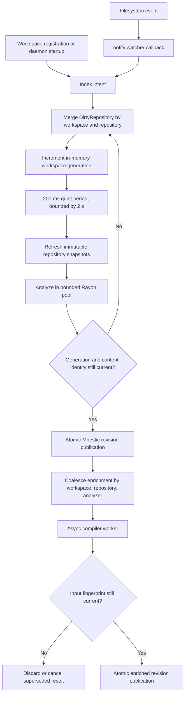
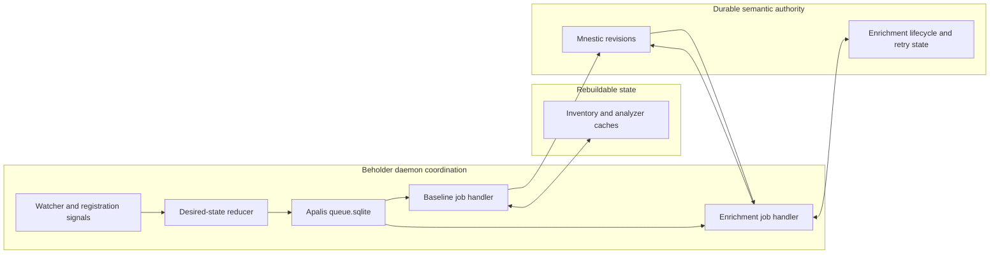

# ADR 0006: Adopt Apalis for durable background work execution

- Status: proposed
- Date: 2026-08-25
- Tracking: https://github.com/benediktms/beholder/issues/116

## Decision

Adopt Apalis with its SQLite backend for Beholder's automatic background indexing
and enrichment work. Store its queue in a dedicated `queue.sqlite`; do not put
queue tables in Mnestic's database.

Keep Beholder's desired-state reduction, content verification, generation and
fingerprint guards, cooperative cancellation, and atomic Mnestic publication
boundaries. Apalis owns durable claiming, retries, worker liveness, orphan
recovery, and scheduling; it does not become the authority for what repository
state should exist.

Use the verified workspace-local `sqlite3-src` compatibility provider so Mnestic
and Apalis share `libsqlite3-sys` without changing or forking Mnestic.

## Current architecture

There is no indexing `mpsc` queue. `IndexScheduler` owns coalesced desired state
and wakes one scheduler loop with `tokio::sync::Notify`.

The implementation responsibilities are:

| Responsibility | Current owner |
| --- | --- |
| Watch registration and callbacks | `crates/daemon/src/daemon.rs` |
| Intent normalization, debounce, generations, bounded retries, shutdown | `crates/daemon/src/indexing/scheduler.rs` |
| Repository inventory and immutable snapshots | `crates/daemon/src/indexing/inventory.rs` |
| Baseline analyzer composition and bounded parallelism | `crates/indexing/src/lib.rs` |
| Enrichment coalescing, cancellation, and execution | `crates/daemon/src/indexing/enrichment.rs` |
| Revision and enrichment lifecycle persistence | `crates/adapters-mnestic/src/storage.rs` |
| Manual indexing entry points | `crates/daemon/src/rpc_service.rs` |
| Spans, OTLP export, and trace propagation | `crates/observability/src/lib.rs` and `crates/worker-client/src/lib.rs` |

`DirtyRepository` merges source, configuration, `HEAD`, and reconciliation
intents. Broader intents subsume narrower ones. More than 1,024 paths or 4,096
events promote a storm to reconciliation. Continuous changes cannot defer a batch
beyond two seconds. One global scheduler operation serializes baseline
publication, standalone repository publication, checkpoints, and maintenance;
source analysis inside that operation is parallel.

Automatic baseline failures retry five times with exponential delays beginning
at 250 ms. The workspace stays dirty when retries are exhausted, and periodic
60-second reconciliation or a later signal tries current state again. Manual RPC
indexing is synchronous from the caller's perspective and uses Tokio's blocking
pool rather than the automatic scheduler loop.

Compiler jobs use an in-memory map keyed by
`(workspace, repository, analyzer)`. A newer fingerprint replaces queued work and
cooperatively cancels an active superseded run. Retry count, next retry time,
error, analyzer version, and input fingerprint are persisted in Mnestic. Five
attempts are allowed with the same 250 ms exponential base.

### Work model and scope

Baseline work is keyed by workspace name, with one merged `DirtyRepository` per
logical repository. The registered canonical worktree and descriptor set scope
inventory refresh; `WorkspaceView` carries the repository states that scope
publication. The in-memory generation is a stale-result guard, not a durable job
identity. It may restart from zero because content and analyzer identity are
verified again before publication.

Enrichment work is keyed by `(workspace, target repository, analyzer)` and carries
the immutable target input fingerprint, repository-scoped compiler context,
analyzer version, snapshot, and view. This is already the deterministic identity
needed for coalescing; adding a generic `job_kind` or separate `worktree_id` would
duplicate typed state Beholder already owns.

### State and recovery

| State | Lifetime | Recovery consequence |
| --- | --- | --- |
| Dirty intents, generations, debounce timers, baseline retry count | Memory | Lost on crash; every registered workspace is marked for authoritative indexing on startup. |
| Active operation and enrichment cancellation handles | Memory | Lost on crash; no graph fact depends on them. |
| Workspace registry | Disk | Recreates watcher ownership and startup indexing. |
| Inventory manifests and content blobs | Disk, rebuildable | Accelerate validated reindexing but never authorize a semantic revision. |
| Baseline and enriched graph revisions | Mnestic | A write transaction either publishes the complete revision or leaves the previous revision active. |
| Enrichment status and retry state | Mnestic | Survives restart, but currently has the recovery gap below. |

Baseline queue durability is unnecessary for correctness: repositories and
workspace registration are the durable input, startup revalidates them, and
periodic reconciliation repairs missed watcher events. Generations 41 and 42 may
disappear when 43 exists; only analysis of current desired state may publish.
Earlier path intents must first be merged into that desired state, which is why a
FIFO deduplication key cannot replace `DirtyRepository`.

Queries keep reading the last completed revision while a replacement is built.
The scheduler checks shutdown between inventory, analysis, verification, and
publication. Graceful shutdown stops accepting new work and waits for the active
blocking operation and checkpoint; it does not interrupt synchronous analyzer
code in the middle of a call. A process crash relies on transaction atomicity and
startup reconstruction instead.

### Confirmed recovery defect

An enrichment is persisted as `running` before its worker future starts. A daemon
crash or forced shutdown can leave that row behind. On restart,
`prepare_enrichment` returns `Running`, while the in-memory `enriching` map is
empty, so the job is never queued again for the same input fingerprint.

This needs a focused fix regardless of Apalis. On daemon startup, or when
preparing an enrichment with no matching live run, reclaim the persisted
`running` state into the existing bounded retry policy. Publication remains safe
because it already rejects stale fingerprints and superseded analyzer versions.

## Apalis evaluation

Versions inspected on 2026-08-24:

- [`apalis-sqlite` 1.0.0-rc.8](https://crates.io/crates/apalis-sqlite/1.0.0-rc.8),
  published 2026-05-07;
- [`apalis` 1.0.0-rc.9](https://crates.io/crates/apalis/1.0.0-rc.9),
  published 2026-05-06.

The current line is still a release candidate. The published source was checked,
not only its README.

| Capability | Verified behavior | Beholder consequence |
| --- | --- | --- |
| Durable enqueue | Jobs are inserted into SQLite before execution. | Useful, but baseline indexing is already reconstructible. |
| Worker loss | Worker heartbeats default to 30 seconds; work owned by a dead worker is re-enqueued after a configurable interval, five minutes by default. Recovery is at-least-once. | Would fix orphan execution, but job handlers must remain idempotent and publication-guarded. |
| Long-running jobs | Liveness is worker-based, not a fixed per-job lease. A healthy worker can run for minutes. | Suitable for indexing, provided the worker runtime continues heartbeating. |
| Graceful shutdown | The monitor stops intake and drains tracked futures indefinitely unless a terminator or shutdown timeout drops them. Dropped work is later orphan-recovered. | Beholder must still choose drain versus cancel per job kind. |
| Retries | SQL attempts and per-task maxima are persisted; failed work is eligible again. Backoff and transient/permanent classification require policy configuration. | Beholder's typed failure policy remains application logic. |
| Idempotency | rc.8 adds a unique `(job_type, idempotency_key)` index and enqueue uses `ON CONFLICT DO NOTHING`. | Prevents duplicate insertion, but does not merge intents, replace payloads, cancel active stale work, or remove old generations. |
| Scheduling | `run_at`, priority, polling, and multiple workers are supported. | More machinery than the current single-daemon desired-state loop needs. |
| SQLite | Setup enables WAL, `synchronous=NORMAL`, in-memory temporary storage, a 64,000-page cache, SQLx pooling, and migrations. Polling begins at 100 ms with backoff; an update-hook mode also exists. | Use a dedicated database. The native dependency conflict is resolved by the verified compatibility provider below. |
| Cleanup | The exposed vacuum operation deletes terminal rows and executes full `VACUUM`. | Retention and when to run blocking maintenance remain Beholder-owned. |
| Multiple job types | Separate typed storage handles can share a pool; `SharedSqliteStorage` multiplexes typed queues. | Technically possible, though each Beholder job still needs its own domain policy. |
| Tracing | A Tower tracing layer emits task spans with task ID and attempt. Producer-to-consumer OpenTelemetry context works when `TracingContext` metadata is explicitly attached. | Trace propagation is available but not automatic from Beholder spans. |
| Metrics | Optional layers emit consumed-task count and execution duration. SQL inspection APIs expose queue state. | Queue latency, queued/active/dead gauges, retry counts, and Beholder dimensions still need explicit instrumentation. |

### What Apalis would replace

For automatic baseline indexing, Apalis could replace only the wake/retry timer
and task-execution shell around `reindex_dirty`. It would not replace filesystem
event classification, `DirtyRepository` merging, generation checks, inventory
refresh, analyzer execution, or atomic publication.

For enrichment, it could replace the in-memory pending map, retry sleepers,
worker heartbeat, and some persisted execution status. Beholder would still own
target/context identity, active-run supersession, cooperative cancellation,
analyzer-version checks, contribution ownership, and current-fingerprint
publication. Manual index RPCs would either remain direct or require a deliberate
asynchronous API change.

No adapter, analyzer, worker protocol, semantic relation, query, or Mnestic
publication code becomes redundant. Apalis would replace plumbing at the edge of
the difficult logic rather than the difficult logic itself.

Relevant upstream implementation points are the
[`Config` defaults](https://github.com/apalis-dev/apalis/blob/v1.0.0-rc.9/apalis-sql/src/config.rs),
[`apalis-sqlite` setup and worker backend](https://github.com/apalis-dev/apalis-sqlite/blob/v1.0.0-rc.8/src/lib.rs),
[`Jobs` schema](https://github.com/apalis-dev/apalis-sqlite/blob/v1.0.0-rc.8/migrations/20251018164941_move_to_bytes.sql),
[`idempotency` migration](https://github.com/apalis-dev/apalis-sqlite/blob/v1.0.0-rc.8/migrations/20260506101935_idempotency_key.sql),
[`orphan recovery` query](https://github.com/apalis-dev/apalis-sqlite/blob/v1.0.0-rc.8/queries/backend/reenqueue_orphaned.sql), and
[`Monitor` shutdown](https://github.com/apalis-dev/apalis/blob/v1.0.0-rc.9/apalis-core/src/monitor/mod.rs).

### SQLite dependency integration

The current packages cannot be added to `beholderd` without changing Beholder's
SQLite dependency topology.

Beholder enables Mnestic's `storage-sqlite-src` feature and uses `sqlite 0.36.2`,
which brings `sqlite3-src 0.6.1` with `links = "sqlite3"`.
`apalis-sqlite` uses SQLx 0.8.6, which brings `libsqlite3-sys` with the same Cargo
`links = "sqlite3"` value. A temporary resolver check with only
`sqlite = "=0.36.2"` and `apalis-sqlite = "=1.0.0-rc.8"` fails because Cargo
allows only one package to own a native link name.

Changing Mnestic's manifest to use `libsqlite3-sys` works, but Beholder does not
own Mnestic and will not depend on an unreleased revision or maintain a fork.
Changing the high-level `sqlite` crate also works but merely moves the fork.

A no-fork compatibility option was verified instead. A small Beholder-owned
crate can provide the package identity `sqlite3-src 0.6.1` through Cargo's
workspace-wide `[patch.crates-io]`. Its existing `bundled` feature delegates to
`libsqlite3-sys/bundled`, and its Rust library explicitly references
`libsqlite3_sys` so the native link metadata is retained. Mnestic and `sqlite`
remain the unmodified crates.io releases.

The shim prototype resolved one `libsqlite3-sys 0.30.1` native provider shared
by Mnestic and SQLx. One process successfully created and reopened a Mnestic
database, passed SQLite `PRAGMA integrity_check`, and ran Apalis migrations
against a separate queue database. A second executable without Apalis proved
that the same shim links published Mnestic independently, matching Beholder's
CLI topology.

This removes the dependency conflict without changing third-party source, but it
is still a deliberate compatibility shim. It relies on `sqlite3-src` remaining a
link-provider dependency rather than a Rust API and must be revalidated whenever
Mnestic, `sqlite`, `sqlite3-sys`, SQLx, or `libsqlite3-sys` changes. Validate both
the standalone CLI and combined daemon topologies on the existing Linux and
macOS CI platforms. A separate `queue.sqlite` file remains a runtime isolation
choice, not a compile-time fix.

## Recommended target architecture

Responsibilities remain deliberately split:

- Beholder owns intent subsumption, desired-state identity, repository/worktree
  selection, view construction, generation checks, supersession, and cancellation.
- The indexer owns typed analyzer composition and bounded CPU parallelism.
- Mnestic owns atomic semantic publication and the small amount of durable
  enrichment lifecycle state whose output is not reconstructed synchronously.
- Filesystem contents, Git identity, and registered workspace configuration remain
  the authority from which baseline work is reconstructed.

Do not introduce a generic `JobQueue` trait. Keep Apalis types inside the daemon
adapter and expose the existing domain operations such as `mark_workspace`,
`merge_repository_intent`, and `queue_enrichment`.

Use a dedicated `state_dir().join("queue.sqlite")` file and SQLx pool. Do not
place its tables in `beholder.db`: queue migrations, retention, full `VACUUM`,
corruption, and deletion have a different lifecycle from rebuildable semantic
revisions.

## Testing strategy

Retain the existing focused tests for watcher intent merging, bounded storms,
maximum batch latency, retry exhaustion, stale publication rejection, concurrent
reads, and shutdown. Add one deterministic persistent-store integration test:

1. publish a baseline and mark its enrichment `running`;
2. drop and reopen the daemon/store without completing it;
3. reclaim the orphan into the retry policy;
4. run it once and publish only if its fingerprint remains current;
5. assert that the previous complete graph remains queryable throughout.

Before repository integration is complete, extend the isolated temporary-SQLite
prototype to cover duplicate enqueue, crash after claim,
restart recovery, timeout shutdown, poisoned work, two concurrent workers, two
repositories, stale-generation no-op, retention, and trace-context propagation.
Run the same semantics suite against the current scheduler so the migration
cannot weaken an existing guarantee.

## Migration and scope

Migrate incrementally, preserving the current domain behavior until each Apalis
path passes the same semantics tests. The expected implementation remains roughly
three to five engineering weeks before cross-platform dogfood:

1. add the verified native SQLite compatibility provider and validate Mnestic
   persistence in Linux and macOS CI;
2. add a dedicated database below the existing platform-specific daemon state
   directory, with migration, retention, and corruption policy;
3. keep or rebuild Beholder's desired-state reducer around the Apalis executor;
4. preserve synchronous manual-index RPC behavior or deliberately version that
   API;
5. port enrichment supersession, cooperative cancellation, typed retry policy,
   and stale-result guards;
6. wire Beholder-specific spans, trace metadata, queue metrics, shutdown, and
   deterministic crash tests.

That work would significantly modify `crates/daemon/src/main.rs`,
`crates/daemon/src/indexing/scheduler.rs`,
`crates/daemon/src/indexing/enrichment.rs`, and `crates/daemon/Cargo.toml`.
It would also force SQLite-linkage work in `crates/adapters-mnestic` before the
queue could compile. Inventory, analyzer adapters, worker protocol, domain facts,
query presentation, and Mnestic publication semantics should otherwise remain
unchanged. No current module can be removed wholesale because Apalis does not own
the hard Beholder-specific responsibilities.

| Adoption impact | Modules |
| --- | --- |
| Removed | None wholesale; only the existing wake/retry plumbing after equivalent behavior is proven. |
| Significantly modified | `crates/daemon/src/main.rs`, `crates/daemon/src/indexing/scheduler.rs`, `crates/daemon/src/indexing/enrichment.rs`, `crates/daemon/Cargo.toml`, and SQLite linkage in `crates/adapters-mnestic`. |
| Remain unchanged | Inventory semantics, analyzer adapters, `crates/indexing`, worker protocol and executables, domain/DTO types, query presentation, and Mnestic publication transactions. |

## Consequences

- Beholder gains durable claiming, retries, worker liveness, orphan recovery, and
  scheduling instead of maintaining those mechanisms in its daemon schedulers.
- A new runtime dependency, queue database, migration surface, polling loop,
  retention policy, and persistence diagnostic path are introduced.
- Baseline recovery still validates queued work against current authoritative
  inputs before publishing results.
- Beholder retains the coalescing and publication rules required for correctness.
- Mnestic and Apalis use separate SQLite files with independent migrations and
  lifecycles.
- Beholder owns a small native-link compatibility provider and must revalidate it
  when the SQLite dependency graph changes.
