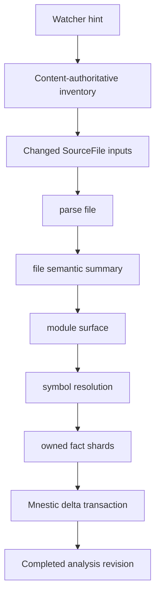

# ADR 0007: Incremental semantic computation

- Status: accepted
- Date: 2026-08-27

## Context

Beholder currently treats repository analysis as the production cache and
publication unit. A changed source file can therefore trigger repository-wide
analysis followed by replacement of the workspace baseline, even when the
file's semantic output is unchanged. On a large persistent graph, baseline
replacement has taken several minutes after sub-second source analysis.

ADR 0004 makes source identity content-authoritative and narrows watcher-driven
inventory refresh. That avoids reading and hashing unrelated source bytes. It
does not make semantic analysis or graph publication incremental.

The semantic graph answers questions about software, such as which symbol calls
another symbol. It cannot be the authority for invalidation: changed source may
introduce dependencies that the last published graph cannot contain. Beholder
also needs a separate analysis dependency graph that records which computations
read which inputs.

## Decision

Beholder will become an incremental computation system. Repository analysis is
retained as a compatibility boundary during migration, but is no longer the
fundamental unit of recomputation or publication.

The initial implementation uses Salsa for the in-process analysis dependency
graph and targets the Rust frontend. Salsa tracked functions must remain
deterministic: filesystem and Git reads populate inputs, while compiler
processes and Mnestic writes remain outside the query engine.



A changed input propagates only while a computed semantic output changes.
Whitespace or comments may change source content and syntax while leaving the
semantic summary unchanged. A function-body change may replace that function's
outgoing facts while leaving its interface and callers unchanged. An interface
change propagates through reverse analysis dependencies until recomputed outputs
compare equal.

### Identities and fingerprints

The Rust slice introduces stable identities for files, modules, and externally
addressable symbols. Symbol identity is based on logical repository, module,
qualified name, kind, and semantic overload disambiguation; source locations
are evidence, not identity. Anonymous and local constructs may use weaker
file-local identities because no external computation depends on them directly.

Invalidation distinguishes:

| Unit | Fingerprints |
| --- | --- |
| Source file | content |
| Parsed file | syntax |
| File summary | semantic |
| Module | imports and exports |
| Symbol | interface and body |
| Repository | dependency environment |
| Workspace | contract environment |

These are semantic comparison boundaries, not a requirement for one persisted
object per fingerprint.

### Computation layers

The incremental query graph is layered:

1. `SourceFile` inputs contain verified bytes and language/configuration identity.
2. `parse_file` produces reusable syntax for one file.
3. `file_summary` produces declarations, imports, exports, unresolved reference
   candidates, calls, protocol observations, and diagnostics. It does not perform
   cross-file resolution.
4. module and symbol queries compute surfaces, resolve references, and produce
   direct semantic facts.
5. fact shards replace only facts owned by changed analysis units.

Symbol is the dependency and invalidation unit. File or module is the initial
persistence unit, avoiding hundreds of thousands of cache files and independent
serialization operations.

Salsa's durability levels are validation hints for inputs with different change
frequencies. They are not durable storage. Mnestic remains the durable authority
for semantic facts and completed revisions. Cross-process persistence of the
Salsa database is not required for the initial Rust slice and will be evaluated
only after warm-process incrementality is measured.

### Fact ownership and revisions

Every direct fact has an owner and producer identity. Publishing an analysis
unit atomically replaces that owner's prior direct facts instead of rebuilding
the workspace baseline. A completed `AnalysisRevision` becomes a coherent
manifest of the selected shard versions and repository states. The manifest is
advanced in the same transaction as changed shards, so queries observe either
the previous completed revision or the new completed revision, never a partial
update.

Mnestic continues to own durable facts and inference. Eager storage is limited
to direct semantic edges needed by ordinary queries. Expensive graph algorithms
such as transitive paths, blast radius, shortest paths, and strongly connected
components remain Rust queries that can be cached against the completed graph
revision. Module SCCs are recomputed when module dependency topology changes;
they are not a second general-purpose invalidation scheduler.

Publication cost must be proportional to changed semantic output, not the total
selected graph size or historical database size. Publishing advances a revision
manifest by selecting immutable repository states, fact shards, and enrichments;
superseded data becomes unreachable and is reclaimed by asynchronous garbage
collection rather than synchronous publication.

Enrichment uses the same manifest model. Analyzer output is stored once under a
content-addressed snapshot identity. Each revision selects at most one snapshot
per repository and analyzer; a base publication copies those small selections
without copying their entities, observations, overrides, or diagnostics. When an
input changes, the newest selected snapshot remains queryable but no longer
matches the revision's expected enrichment fingerprint, so query freshness is
reported as stale for the affected repository until a replacement snapshot is
selected.

Queries join the selected snapshots and resolve only their logical collisions:
base facts win, while competing analyzer facts use confidence and stable analyzer
identity. Enrichment publication atomically stores a missing immutable snapshot,
replaces one manifest selection, and advances the revision. Superseded snapshots
and the former materialized baseline are removed by background garbage collection.
Base publication must not recreate revision-local enrichment facts.

One persistent Mnestic database retains atomic workspace revisions and direct
cross-repository queries. Database-per-repository partitioning or a storage-engine
migration is deferred unless measurements show sustained writer contention; large
read plans, synchronous materialization, and foreground garbage collection must
first be excluded because they are independent of SQLite's single-writer limit.

### Initial Rust slice

The first executable slice must cover the whole hot path rather than proving
incremental parsing in isolation:

```text
verified Rust file
  -> tracked parse
  -> tracked file summary
  -> stable symbol fingerprints
  -> changed fact shards
  -> Mnestic delta publication
```

It is accepted when an integration test records query executions and published
shards for three edits:

- whitespace/comment-only: no semantic shard changes;
- function body: only body-dependent facts owned by that symbol change;
- public interface: reverse dependants are reconsidered and propagation stops
  when their outputs remain equal.

The same slice is then benchmarked by indexing Beholder itself with the installed
daemon. Measurements report inventory, parse, summary, resolution, changed
shards, Mnestic publication, and total job time separately.

Other language frontends adopt the boundary only after the Rust slice proves it.
The shared contract will be extracted from at least two real frontends rather
than predicting every language's symbol model in advance.

## Consequences

- Ordinary edits no longer imply repository-wide semantic recomputation or
  workspace-wide baseline replacement.
- ADR 0004 inventory, repository dependency identities, worker identities,
  revision guards, and durable scheduling remain inputs and orchestration around
  the incremental engine.
- The existing semantic graph remains the query result and cross-repository
  semantic model; it does not decide what source analysis must run.
- Compiler-backed enrichment may remain repository-scoped initially. Its outputs
  can later become tracked coarse inputs without moving subprocess side effects
  into Salsa.
- Mnestic delta publication is part of the first usable implementation because
  full baseline replacement is already a measured bottleneck.
- Cache eviction, cross-process query persistence, incremental Tree-sitter edits,
  and dynamic SCC maintenance are deferred until profiling shows they are needed.

## References

- [Salsa overview](https://salsa-rs.github.io/salsa/overview.html)
- [Salsa incremental algorithm](https://salsa-rs.github.io/salsa/reference/algorithm.html)
- [Salsa tuning and cancellation](https://salsa-rs.github.io/salsa/tuning.html)
- [Beholder vision: AnalysisRevision](../VISION.md#16-analysisrevision)
- [Beholder vision: content-addressed analysis deduplication](../VISION.md#18-content-addressed-analysis-deduplication)
